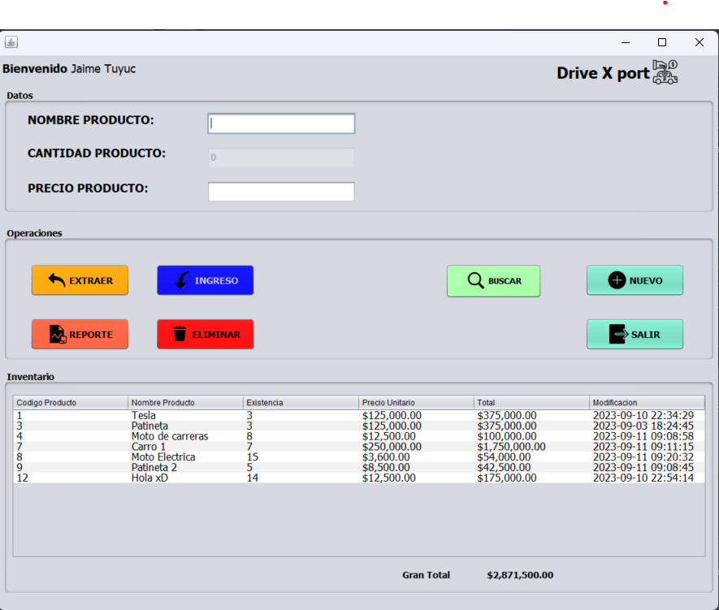

# Concesionaria Drive X Port

**Menu**
- [English](#english)
- [Spanish](#spanish)

## English

**Project Content**
- [User Manual](#user-manual)
- [Project Overview](#project-overview)
- [Project Structure](#project-structure)
  - [Assets](#assets)
  - [Data](#data)
  - [DBConnection](#dbconnection)
  - [Utils](#utils)
  - [Compose File](#compose-file)
  - [UI](#ui)
    - [Login](#login)
    - [Register](#register)
    - [Create Invoice](#create-invoice)
- [Running the Project](#running-the-project)
- [Images](#images)

## Spanish

**Contenido del proyecto**
- [Manual de usuario](#manual-de-usuario)
- [Resumen del Proyecto](#resumen-del-proyecto)
- [Estructura del Proyecto](#estructura-del-proyecto)
  - [Recursos](#recursos)
  - [Datos](#datos)
  - [Conexión a la BD](#conexión-a-la-bd)
  - [Utilidades](#utilidades)
  - [Archivo de Composición](#archivo-de-composición)
  - [Interfaz de Usuario (UI)](#interfaz-de-usuario-ui)
    - [Inicio de Sesión](#inicio-de-sesión)
    - [Registro](#registro)
    - [Crear Factura](#crear-factura)
- [Ejecución del Proyecto](#ejecución-del-proyecto)
- [Images](#images)

## Project Overview
This is a project for Programacion II at Mariano Galvez that uses Java UI.form.

## Project Structure

### Assets
Inside the assets folder, you can find all the icons used in the app.

### Data
Inside the data folder, we stored the init2.sql, which gets executed when the compose file gets mounted. It runs a migration script that will create the table and insert some records in the DB.

### DBConnection
In the file, we can find all the functions that connect to the DB and execute the functions.
- Connection to the DB
- Insert a new record in the DB
- Get a single record
- Update a single record
- Delete a record
- Close the DB connection

### Utils
The file contains some utilities to split the app and handle it better, including:
- PdfReport: Class where we stored the two functions to create a table that will include all the records from the DB.
- Queries: Class that stores all the functions and the required queries to pass to the DB.
- Validations: Class where we stored a function that validates if a string is empty.

### Compose File
The file contains the logic to run two containers, MySQL using version 8.1.0 and the latest version of phpmyadmin/phpmyadmin.

### UI
The main file in the app, where all the logic of the UI components live, including buttons, labels, text fields, icons, and the list of the components.

#### Login
The file contains the logic to validate email and password of the user before giving access to it.

#### Register
The file contains the logic and UI styles to create a new account, including some validations:
- Email must be a valid one
- Validate that the email is not being used before
- Password length of a minimum of 6 characters.

#### Create Invoice
This file contains the logic of creating an invoice when a product is extracted from the DB. It has validations that update the DB with the corresponding data as long as the user fills in all the fields. The library itextpdf@5.5.9 was used to achieve this.

## Running the Project
To run the project, follow these steps:

1. Clone the repository to your local machine.
2. Duplicate the `compose-variables-template.env` file and rename it to `compose-variables.env`.
3. Inside the `compose-variables.env` file, replace the variables with your database credentials and container names as specified.
4. Inside the `DBConnection.java` file, add your URL connection.
5. Run `docker-compose up -d` to start the containers.
6. Visit `http://localhost:8081` to access PHPMyAdmin and verify the database.
7. Execute the UI file to run the project.

*-*-*-*-*-*-*-*-*-*-*-*-*-*-*-*-*-*-*-*-*-*-*-*-*-*-*-*-*-*-*-*-*-*-*-*-*-*-*-*-*-*-*-*-*-*-*-*-*-*-*-*-*-*-*-*-*-*-*-*-*-*-*-*-*-*-*-*-*-*-*-*-*-*-*-*-*-*-*-*-*-*-*-*-*-*-*-*-*-*-*-*-*-*-*-*-*-*-*-*-*-*-*-*-*-*-*-*-*-*-*-*-*-*-*-*-*-*-*-*-*-*-*-*-*-*-*-*-
## Resumen del Proyecto
Este es un proyecto para Programación II en Mariano Gálvez que utiliza Java UI.form.

## Estructura del Proyecto

### Recursos
Dentro de la carpeta de recursos, puedes encontrar todos los íconos utilizados en la aplicación.

### Datos
Dentro de la carpeta de datos, almacenamos init2.sql, que se ejecuta cuando se monta el archivo de composición. Ejecuta un script de migración que creará la tabla e insertará algunos registros en la BD.

### Conexión a la BD
En el archivo, podemos encontrar todas las funciones que se conectan a la BD y ejecutan las funciones.
- Conexión a la BD
- Insertar un nuevo registro en la BD
- Obtener un solo registro
- Actualizar un solo registro
- Eliminar un registro
- Cerrar la conexión a la BD

### Utilidades
El archivo contiene algunas utilidades para dividir la aplicación y manejarla mejor, incluyendo:
- PdfReport: Clase donde almacenamos las dos funciones para crear una tabla que incluirá todos los registros de la BD.
- Queries: Clase que almacena todas las funciones y las consultas requeridas para pasar a la BD.
- Validations: Clase donde almacenamos una función que valida si una cadena está vacía.

### Archivo de Composición
El archivo contiene la lógica para ejecutar dos contenedores, MySQL utilizando la versión 8.1.0 y la última versión de phpmyadmin/phpmyadmin.

### Interfaz de Usuario (UI)
El archivo principal en la aplicación, donde vive toda la lógica de los componentes de la interfaz de usuario, incluyendo botones, etiquetas, campos de texto, iconos y la lista de los componentes.

#### Inicio de Sesión
El archivo contiene la lógica para validar el correo electrónico y la contraseña del usuario antes de otorgar acceso.

#### Registro
El archivo contiene la lógica y los estilos de la interfaz de usuario para crear una nueva cuenta, incluyendo algunas validaciones:
- El correo electrónico debe ser válido
- Validar que el correo electrónico no se haya utilizado antes
- La contraseña debe tener una longitud mínima de 6 caracteres.

#### Crear Factura
Este archivo contiene la lógica de crear una factura cuando se extrae un producto de la BD. Tiene validaciones que actualizan la BD con los datos correspondientes siempre que el usuario complete todos los campos. Se utilizó la biblioteca itextpdf@5.5.9 para lograrlo.

## Ejecución del Proyecto
Para ejecutar el proyecto, siga estos pasos:

1. Clone el repositorio en su máquina local.
2. Duplique el archivo `compose-variables-template.env` y cámbiele el nombre a `compose-variables.env`.
3. Dentro del archivo `compose-variables.env`, reemplace las variables con sus credenciales de la base de datos y los nombres de los contenedores según se especifica.
4. Dentro del archivo `DBConnection.java`, agregue su URL de conexión.
5. Ejecute `docker-compose up -d` para iniciar los contenedores.
6. Visite `http://localhost:8081` para acceder a PHPMyAdmin y verificar la base de datos.
7. Ejecute el archivo de la interfaz de usuario para ejecutar el proyecto.


*-*-*-*-*-*-*-*-*-*-*-*-*-*-*-*-*-*-*-*-*-*-*-*-*-*-*-*-*-*-*-*-*-*-*-*-*-*-*-*-*-*-*-*-*-*-*-*-*-*-*-*-*-*-*-*-*-*-*-*-*-*-*-*-*-*-*-*-*-*-*-*-*-*-*-*-*-*-*-*-*-*-*-*-*-*-*-*-*-*-*-*-*-*-*-*-*-*-*-*-*-*-*-*-*-*-*-*-*-*-*-*-*-*-*-*-*-*-*-*-*-*-*-*-*-*-*-*-

## User Manual
Will try to keep as simple as possible the way of using the app.

When the app start, we will see:
- **Login Screen** from here, we can enter our ```email``` and ```password``` if we already have an account created.
  The app has validations when a user tries to log in, if the password or the email is incorrect a warning will show up, letting you know that one of the fields has incorrect values, _assuming you don't have an account, go to next step._


- **Register Screeen** On this screen we can create a new account, within this screen we have different fields
  * _Name_
  * _Last name_
  * _Email_
  * _password_

  All of the fields are mandatory to create a new account, the app validates if the email you are entering is already being used by another user, _once you have created your account and log in_ we can move to next step.


- **Dashboard Page**
At the start of the application once you are logged in, at the top of the app you will see your name, the one you used
to register your account, at the right side you will see the ```logo``` and the ```Company name``` the app is divided in
3 parts:
  - Data
  - Operations
  - Inventory

    * _Data_ This section have the fields to create a new product in the inventory, which includes the following fields
      * Product name
      * Product amount _(This is set to 0 by default)_
      * Product price
      
      This part also contains 2 additional buttons, _Insert_ and _Continue_ which will be showed once an operation is selected
      to include a new product inventory or extract one.

    * _Operations_ This part of the application holds all the buttons that will be use to make operations, these are the following:
      * ```Extract``` This will show a modal for the user tu enter a product id to make an extract from the inventory, once a product is find
      it will show a modal for the user to enter the user information to create the invoice, all forms and fields have validations.
      * ```Insert``` This button will open a form for the user to enter a product ID, if a product is find, all the other buttons will get disabled
      just leaving the field to update the new amount.
      * ```Search``` The search button will open a modal for a user to search a product for ID.
      * ```New product``` The adding new button will insert to the DB, once all the fields in the ```Data``` section are filled.
      * ```Report``` The report button will trigger a function that will look into the DB and search all the products that belongs
      to the current user logged in, and it will create a PDF with all the products.
      * ```Delete``` The delete button will pop up a modal for a user to search if the product is in the DB, and will ask to confirm if the product will get permanently deleted from the DB.
      * ```Log out```The button will log out the current session.
    * _Inventory_ This section contains a table with 6 columns
      * ```Product id``` Holds the product ID
      * ```Product name```Holds the product name
      * ```Current existence```Holds the current amount of the product.
      * ```Single price product```Holds the single product price. 
      * ```Total amount```Holds total amount for the current price.
      * ```Last modification```Holds the last date update for the product.
  
  At the bottom of the app we will see the total amount in $ for all the product.

## Manual de usuario
Intentaremos mantenerlo lo más simple posible en la forma de usar la aplicación.

Cuando la aplicación se inicia, veremos:
- **Pantalla de Inicio de Sesión:** Desde aquí, podemos ingresar nuestro ```correo electrónico``` y ```contraseña``` si ya tenemos una cuenta creada.
  La aplicación tiene validaciones cuando un usuario intenta iniciar sesión. Si la contraseña o el correo electrónico son incorrectos, aparecerá una advertencia que indicará que uno de los campos tiene valores incorrectos. _Suponiendo que no tienes una cuenta, pasa al siguiente paso._

- **Pantalla de Registro:** En esta pantalla podemos crear una nueva cuenta. Dentro de esta pantalla tenemos diferentes campos:
  * _Nombre_
  * _Apellido_
  * _Correo electrónico_
  * _Contraseña_

  Todos los campos son obligatorios para crear una nueva cuenta, la aplicación valida si el correo electrónico que estás ingresando ya está siendo utilizado por otro usuario. _Una vez que hayas creado tu cuenta y hayas iniciado sesión_, podemos pasar al siguiente paso.

- **Página del Panel de Control:** Al inicio de la aplicación, una vez que hayas iniciado sesión, en la parte superior de la aplicación verás tu nombre, el que utilizaste para registrar tu cuenta. En el lado derecho verás el ```logotipo``` y el ```nombre de la empresa```. La aplicación está dividida en
  3 partes:
  - Datos
  - Operaciones
  - Inventario

    * _Datos:_ Esta sección tiene los campos para crear un nuevo producto en el inventario, que incluye los siguientes campos:
      * Nombre del producto
      * Cantidad del producto _(esto se establece en 0 de forma predeterminada)_
      * Precio del producto

      Esta parte también contiene 2 botones adicionales, _Insertar_ y _Continuar_, que se mostrarán una vez que se seleccione una operación para incluir un nuevo producto en el inventario o extraer uno.

    * _Operaciones:_ Esta parte de la aplicación contiene todos los botones que se utilizarán para realizar operaciones, que son los siguientes:
      * ```Extraer``` Esto mostrará un cuadro modal para que el usuario ingrese un ID de producto para realizar una extracción del inventario. Una vez que se encuentra un producto, mostrará un cuadro modal para que el usuario ingrese la información del usuario para crear la factura, todos los formularios y campos tienen validaciones.
      * ```Insertar``` Este botón abrirá un formulario para que el usuario ingrese un ID de producto. Si se encuentra un producto, todos los demás botones se deshabilitarán, dejando solo el campo para actualizar la nueva cantidad.
      * ```Buscar``` El botón de búsqueda abrirá un cuadro modal para que el usuario busque un producto por ID.
      * ```Nuevo producto``` El botón de agregar nuevo producto insertará en la base de datos una vez que se completen todos los campos en la sección de ```Datos```.
      * ```Informe``` El botón de informe activará una función que buscará en la base de datos todos los productos que pertenecen al usuario actualmente registrado y creará un PDF con todos los productos.
      * ```Eliminar``` El botón de eliminar mostrará un cuadro modal para que el usuario busque si el producto está en la base de datos y solicitará confirmación para eliminar permanentemente el producto de la base de datos.
      * ```Cerrar sesión``` El botón cerrará la sesión actual.
    * _Inventario:_ Esta sección contiene una tabla con 6 columnas
      * ```ID del producto``` Contiene el ID del producto.
      * ```Nombre del producto``` Contiene el nombre del producto.
      * ```Existencia actual``` Contiene la cantidad actual del producto.
      * ```Precio unitario del producto``` Contiene el precio individual del producto.
      * ```Cantidad total``` Contiene la cantidad total para el precio actual.
      * ```Última modificación``` Contiene la última fecha de actualización del producto.

  En la parte inferior de la aplicación, verás el monto total en $ de todos los productos.

## Images
Some images of the project.
## Invoice creation


## Invoice form


## New UI Version


## UI Login


## Create Account


## UI Old Version


## Validations


## Edit and Update


